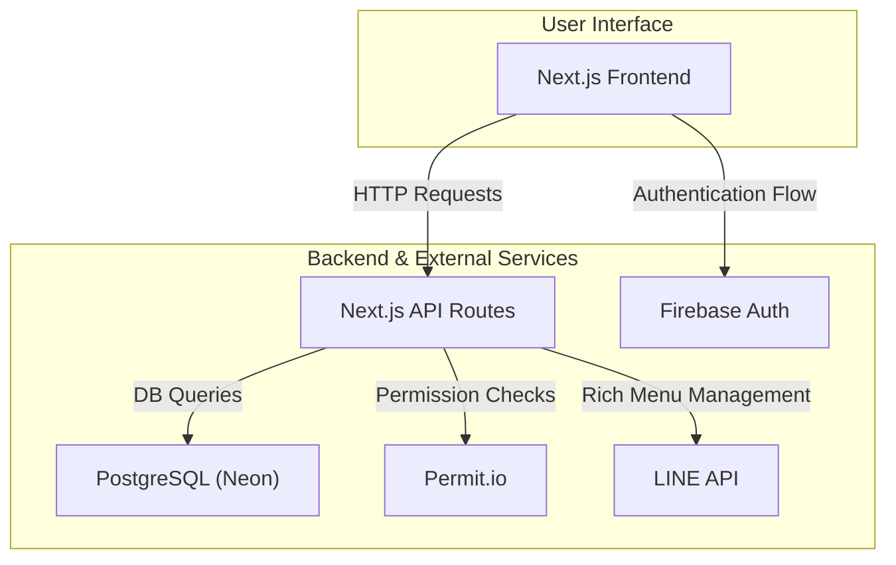
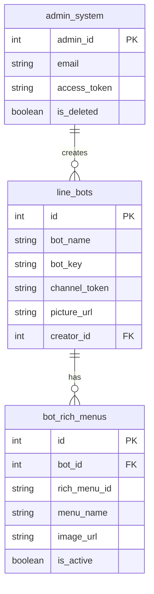
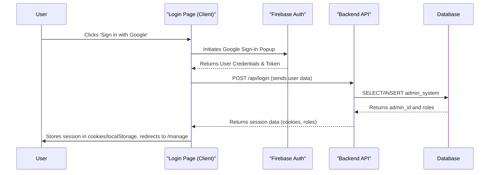
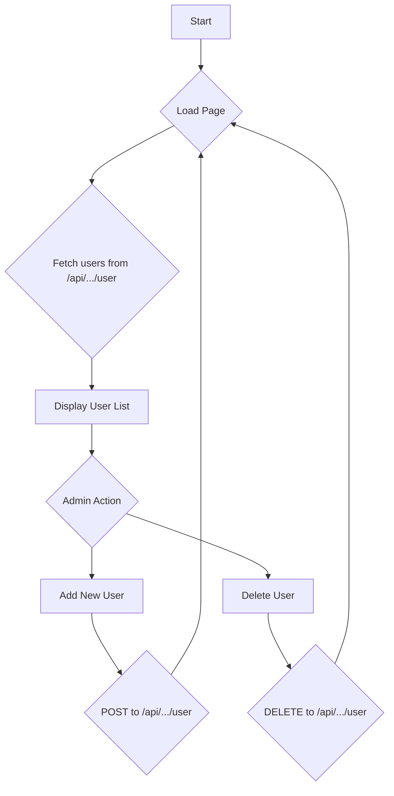
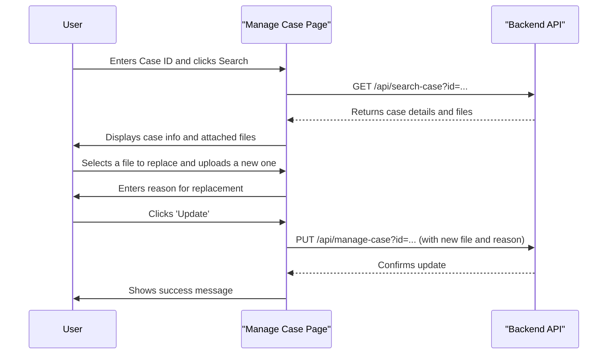
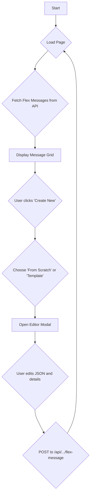
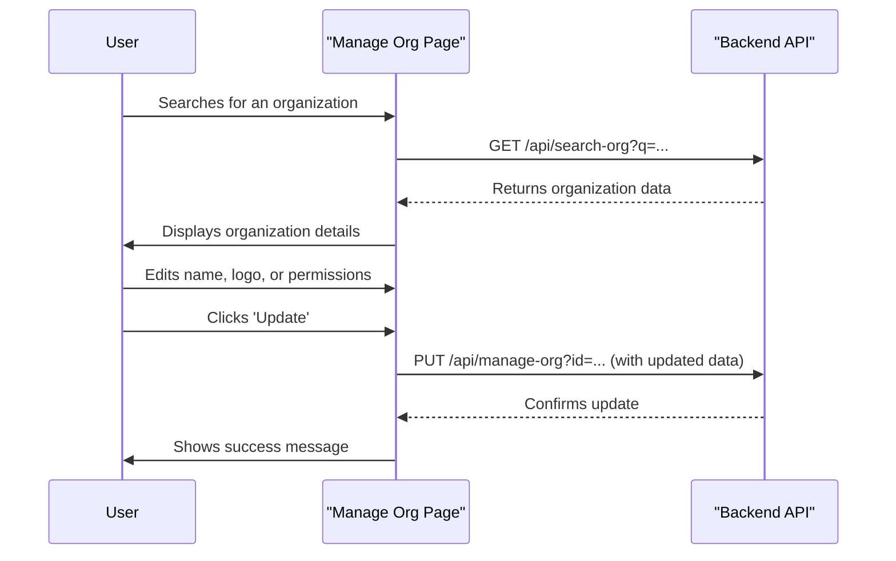
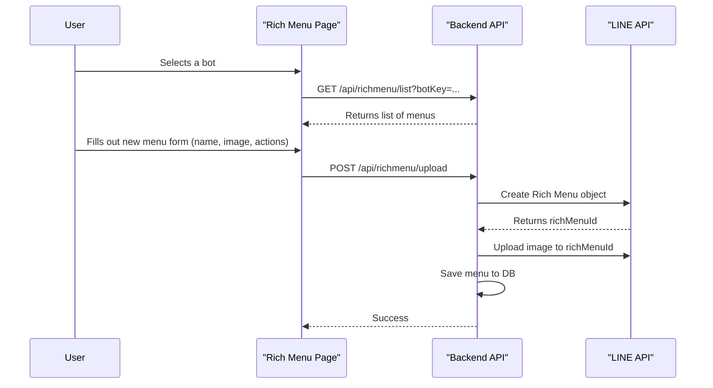
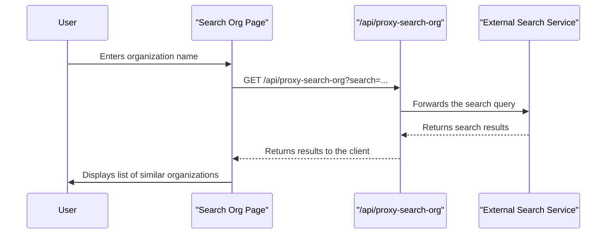

# `app/` Directory Documentation

This document provides a detailed overview of the `app/` directory in the My Internal Web project. It covers the structure, functionality, and key components of the application, with diagrams to help readers deeply understand the project.

## 1. Directory Structure

The `app/` directory is the core of the Next.js application, containing all the UI pages and API routes.

```
/app
├─── api/
│    ├─── Checksession/
│    ├─── GetUserRoles/
│    ├─── proxy-search-org/
│    └─── richmenu/
├─── components/
│    ├─── Login.jsx
│    └─── sidebar.jsx
├─── manage/
├─── manage-case/
├─── manage-flex-message/
├─── manage-org/
├─── manage-richmenu/
└─── search-org/
```

## 2. High-Level Architecture

The application follows a standard Next.js App Router structure.

-   **Frontend:** Built with React and Next.js, using server components for data fetching and client components for interactivity.
-   **Backend:** API routes are defined in the `app/api/` directory and are deployed as serverless functions.
-   **Database:** The application uses a PostgreSQL database hosted on Neon for data persistence.
-   **Authentication:** User authentication is handled by Firebase Authentication with Google as the provider.
-   **Authorization:** Role-based access control is managed by Permit.io.
-   **External Services:** The application interacts with the LINE API for managing Rich Menus and bots.

### Component Diagram

This diagram shows the main components of the system and how they interact.



### Data Model (ER Diagram)

This diagram illustrates the relationships between the main database entities.



### User Login Sequence Diagram

This diagram shows the sequence of events during the user login process.



## 3. Page Workflows

This section explains the workflow of each management page with a diagram.

### 3.1. Manage Emails (`/manage`)

This page allows admins to manage user access.



### 3.2. Manage Case (`/manage-case`)

This page is for managing support cases.



### 3.3. Manage Flex Message (`/manage-flex-message`)

This page is for creating and managing LINE Flex Messages.



### 3.4. Manage Org (`/manage-org`)

This page is for managing organization details.



### 3.5. Manage Rich Menu (`/manage-richmenu`)

This page is for managing LINE Rich Menus.



### 3.6. Search Org (`/search-org`)

This page is for finding duplicate organizations.



## 4. Core Components & Functionality

### 4.1. API Routes (`app/api/`)

This directory contains the backend logic of the application, handling all server-side operations.

-   **`Checksession`**: Verifies the user's session by comparing the `access_token` from the client's cookie with the one stored in the `admin_system` table. This ensures that a user's session is still valid and hasn't been superseded by a login on another device.
-   **`GetUserRoles`**: Fetches the user's roles from the `admin_system` table and cross-references them with Permit.io for fine-grained permissions. It uses a `stale-while-revalidate` caching strategy to minimize latency for frequent requests.
-   **`proxy-search-org`**: Acts as a secure intermediary to an external organization search service. This proxy prevents exposing the external API endpoint to the client and bypasses potential CORS issues.
-   **`richmenu`**: A comprehensive suite of API routes for managing LINE Rich Menus.
    -   `add`: Inserts a new LINE bot's configuration (name, key, token) into the `line_bots` table.
    -   `bots`: Retrieves and lists all registered LINE bots from the database.
    -   `current`: Fetches the `richMenuId` of the currently active Rich Menu for a specific bot directly from the LINE API.
    -   `delete`: Removes a Rich Menu from both the LINE platform and the `bot_rich_menus` table.
    -   `details`: Fetches the detailed JSON structure of a specific Rich Menu from the LINE API.
    -   `image`: Serves the image content of a Rich Menu by fetching it from the LINE API and streaming it back to the client.
    -   `list`: Retrieves all Rich Menus associated with a bot from the `bot_rich_menus` table and syncs it with the list from the LINE API.
    -   `switch`: Sets a specific Rich Menu as the default for all users of a bot via the LINE API and updates the `is_active` flag in the database.
    -   `sync`: Synchronizes the list of Rich Menus from the LINE API with the local database, adding any menus that exist on LINE but not locally.
    -   `upload`: A multi-step process that first creates a Rich Menu object on LINE, then uploads the image content, and finally links it to the bot.
    -   `verify-token`: Validates a LINE bot's channel access token by making a request to the LINE API's `/v2/bot/info` endpoint.

### 4.2. UI Components (`app/components/`)

-   **`Login.jsx`**: The application's entry point for unauthenticated users. It utilizes Firebase UI for a seamless Google Sign-In experience. Upon successful authentication, it sends the user's profile and OAuth token to the backend to establish a session and retrieve application-specific roles.
-   **`sidebar.jsx`**: The primary navigation component. It dynamically renders menu items based on the user's roles fetched from the `GetUserRoles` API. It displays user profile information (avatar, name, roles) and includes a prefetching mechanism on mouse hover to reduce perceived latency when navigating between pages.

### 4.3. Management Pages

-   **`manage/`**: A page for administrators to manage user access. It lists all registered users, their roles, and provides functionality to add new users or revoke access.
-   **`manage-case/`**: An interface for support staff to handle specific cases. It allows searching for a case by its ID and provides tools to view, upload, or replace associated media files (images, videos, documents).
-   **`manage-flex-message/`**: A powerful tool for creating and managing LINE Flex Messages. It features a JSON editor for raw message creation, a gallery of pre-built templates (e.g., receipts, profiles, menus), and a live preview renderer.
-   **`manage-org/`**: A high-level management page for organization-specific settings. Admins can update an organization's name and logo, toggle permissions for CSV data exports, and generate unique QR codes that link to the LINE bot for issue reporting.
-   **`manage-richmenu/`**: A comprehensive dashboard for managing LINE Rich Menus. It provides a visual interface to create, upload, and switch between different Rich Menus for each registered bot. It includes a mapping tool to define tappable areas and their corresponding actions (link, text, API call).
-   **`search-org/`**: A utility page to help prevent data duplication. It uses a similarity search algorithm (via the `proxy-search-org` API) to find organizations with similar names.

## 5. Key Libraries & Technologies

-   **Next.js**: The core framework for the application.
-   **React**: For building the user interface.
-   **Tailwind CSS**: For styling the application.
-   **daisyUI**: A Tailwind CSS component library.
-   **Lucide React**: For icons.
-   **Firebase**: For authentication.
-   **Permit.io**: For authorization and role management.
-   **Neon**: For the PostgreSQL database.
-   **`@neondatabase/serverless`**: The serverless driver for Neon.
-   **`pg`**: The PostgreSQL client for Node.js.
-   **`sweetalert2`**: For displaying alerts and confirmations.

## 6. Getting Started

1.  Install the dependencies:
    ```bash
    npm install
    ```
2.  Create a `.env.local` file and add the necessary environment variables.
3.  Run the development server:
    ```bash
    npm run dev
    ```

The application will be available at `http://localhost:3000`.
